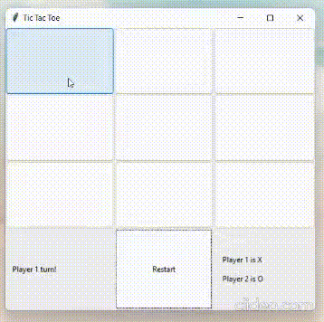

# Tic-Tac-Toe

This repository implements the famous game of Tic-Tac-Toe in Python language using a brute-force approach. This is the solution to the Lab 1 assignment of the course Software Engineering.

## Description

This code is written in Python with the help of a famous GUI library Tkinter. It consists of different functions which perform different tasks. In the end, all these functions come together to make the game work in the form of a simple yet elegant interface made by Tkinter. Note that this game is for 2 human players. The following demo will give a quick walkthrough of the working of the game:

### *This game is for Human vs Human*

## Authors

- [@prks61](https://www.github.com/prks61)-B21CS061
- [@princeverma3844](https://github.com/princeverma3844)-B21CS060

## Documentation

[Tkinter](https://docs.python.org/3/library/tk.html)
